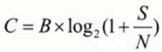
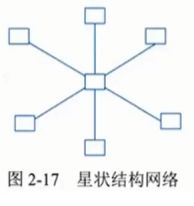
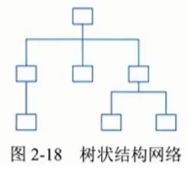
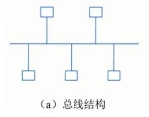
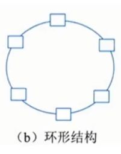

### 计算机网络

#### 计算机网络的功能

1. 数据通信;
2. 资源共享;
3. 管理集中化;
4. 实现分布式处理;
5. 负载均衡

#### **网络有关指标 ☆☆☆**

##### **性能指标**

1. **速率**。网络速率指的是连接在计算机网络上的主机或通信设备在数字信道上传送数据的速率，速率的单位是b/s。
2. **带宽**。“带宽”有两种不同的意义。指一个信号具有的频带宽度。如，在传统的通信线路上传送的电话信号的标准带宽是3.1kz。单位是赫兹。表示网络通信线路传送数据的能力，单位时间内从一个结点到另一个结点所能通过的"最高数据率"。此处带宽单位是b/s
3. **吞吐量**。表示单位时间内通过某个网络(或信道、接口)的数据量。吞吐量受网络的带宽或网络额定速率的限制。
4. **时延 ☆**。时延是指数据(报文、分组)从网络(链路)的一端传送到另一端所需的时间。网络中的时延由以下部分组成:·
	1. **发送时延**:又称为传输时延，指从数据块的第一个比特开始发送算起，到最后一个比特发送完毕所需的时间。
	2. **传播时延**:电或光信号在传输介质传播一定距离所花费的时间。
	3. **处理时延**:检查分组首部和决定将分组导向何处所需要的时间。
	4. **排队时延**:在队列中，分组在等待传输时，它经受排队时延，
5. **往返时间**。往返时间(RTT)也是一个重要的网络性能指标，它表示从发送方发送数据开始，到发送方收到来自接收方的确认(接受方收到数据后便立即发送确认)总共经历的时间。
6. **利用率**。利用率有**信道利用率和网络利用率**两种。信道利用率指信道被利用的概率(即有数据通过)，通常以百分数表示。完全空闲的信道利用率是零。网络利用率是全网络的信道利用率的加权平均值。

##### **非性能指标**

1. 费用;
2. 质量;
3. 标准化;
4. 可靠性;
5. 可扩展性和可升级性;
6. 易管理和维护性。

### 通信技术

计算机网络是利用通信技术将数据从一个结点传送到另一结点的。**通信技术是计算机网络的基础**。信道可分为物理信道和逻辑信道:

- 物理信道由传输介质和设备组成，根据传输介质的不同，分为有线信道和无线信道。
- 逻辑信道是指在数据发送端和接收端之间存在的一条虚拟线路，可以是有连接的或无连接的。逻辑信道以物理信道为载体。

#### 香农公式
信道容量就是信道的最大传输速率，可通过香农公式计算得到

- C代表信道容量，单位是b/s
- B代表信号带宽，单位是Hz
- S代表信号平均功率，单位是W
- N 代表噪声平均功率，单位是W
- S/N代表信噪比，单位是dB(分贝)

#### **通信原理☆☆**

发信机进行的**信号处理**包括**信源编码、信道编码、交织、脉冲成形和调制**。相反地，**收信机**进行的信号处理包括**解调、采样判决、去交织、信道译码和信源译码**。
1. **信源编码 ☆☆**
   **将模拟信号进行模数转换**，再进行**压缩编码**(去除冗余信息)，最后**形成数字信号**。例如GSM(全球移动通信系统)先通过PCM(脉冲编码调制)编码将模拟语音信号转化成二进制数字码流，再利用RPE-LPT(规则脉冲激励-长期预测编码)算法对其进行压缩。2)信道编码
2. **信道编码**
   通过**增加冗余信息**以便在接收端进行**检错**和**纠错**，**解决信道、噪声和干扰导致的误码问题**，一般只能纠正零星的错误，对于连续的误码无能为力。
3. **交织**
   为了**解决连续误码导致的信道译码出错问题**，通过**交织将信道编码之后的数据顺序按照一定规律打乱**，到了接收端在信道译码之前**再通过去交织将数据顺序复原**，这样连续的误码到了接收端就变成了零星误码，信道译码就可以正确纠错了。
4. **脉冲成形**
   **为了减小带宽需求，需要将发送数据转换成合适的波形**，这就是脉冲成形。短形脉冲要求的信道会很宽，主要原因是矩形脉冲的竖边是垂直的,。想要达到这一点要很高的频率，脉冲成形并不要求是垂直的，所以频率要求降低了。
5. **调制**
   调制是将信息承载到满足信号要求的**高频载波信号**的过程。

#### 复用技术和多址技术 ☆

1. **复用技术**
   复用技术是指**在一条信道上同时传输多路数据**的技术，如TDM时分复用、FDM频分复用和CDM码分复用等。ADSL使用了 FDM的技术，语音的上行和下行占用了不同的带宽。
2. **多址技术**
   多址技术是指**在一条线上同时传输多个用户数据**的技术，在接收端把多个用户的数据分离(TDMA时分多址、FDMA频分多址和CDMA 码分多址)。
#### 5G 通信网络

1. 基于OFDM优化的波形和多址接入
2. 实现可扩展的0FDM间隔参数配置
3. 0FDM加窗提高多路传输效率
4. 灵活框架设计
5. 大规模 MIM0(Multiple-Input Multiple-0utput)
6. 毫米波
7. 频谱共享
8. 先进的信道编码设计。

#### 网络

**网络**通常按照网络的**覆盖区域和通信介质**等特征来分类，可分为**局域网(LAN)、无线局域网(WLAN)、城域网(MAN)、广域网(WAN)和移动通信网**等。

##### **局域网(LAN)**

局域网(LocalArea Network，LAN)是指在**有限地理范围内**将若干计算机通过传输介质互联成的计算机组(即通信网络)，通过网络软件实现计算机之间的文件管理、应用软件共享、打印机共享、工作组内的日程安排、电子邮件和传真通信服务等功能。
##### **网络拓扑 ☆☆**

局域网专用性非常强，具有比较稳定和规范的拓扑结构。常见的局域网拓扑结构有星状结构、树状结构、总线结构和环形结构。

- **星型**: 中心结点是控制中心，任意两个结点间的**通信最多只需两步**，**传输速度快、网络构简单、建网容易**、便于控制和管理。这种结构的缺点是**可靠性低**，网络共享能力差，并且一旦**中心结点出现故障**则导致**全网瘫痪**。
- **树形**: 网络成本低，结构简单，结点扩充方便、灵活，**方便寻查链路路径**除叶结点及其相连的链路外，任何一个工作站或链路产生故障都会影响整个网络系统的正常运行。
- **总线结构**。总线结构网络是将各个结点设备和一根总线相连网络中所有的结点设备都是通过总线进行信息传输的。在总线结构中，作为数据通信必经的**总线的负载能力是有限度的**，这是由通信媒体本身的物理性能决定的。总线作为连接各结点设备通信的枢纽，它的故障将影响总线上每个结点的通信。
- **环形结构**。将网络中各结点通过一条首尾相连的通信链路连接起来，形成一个闭合环形结构网。环形结构的网络中各结点设备的地位相同，信息按照固定方向单向流动，两个节点之间仅有一条通路，系统中无信道选择问题，**任一结点的故障将导致物理瘫痪**。由于环路是封闭的，所以环形结构的网络不便于扩充，系统响应延时长，且信息传输效率相对较低。
- **网状结构**。网状网络中的**任何结点彼此之间均存在一条通信链路**，任何结点故障不会影响其他结点之间的通信。但这种拓扑结构的网络布线较为烦琐，且建设成本高，控制方法复杂。

##### 以太网技术

**以太网**(Ethernet)是**一种计算机局域网组网技术**。IEEE制定的IEEE802.3标准给出了以太网的技术标准。

###### 以太网结构

**最大帧长为1518字节**(最大的数据帧为1500字节)，**最小帧长为64字节 ☆**，如果不足则需要加入填充位。
帧头设有32位用于进行CRC32校验，参与校验的是帧头中除前导字段和帧起始符之外的部分。

[[4938e0d3746624b1e078edff3f7774f6_MD5.jpeg|Open: Pasted image 20250422002106.png]]
![[4938e0d3746624b1e078edff3f7774f6_MD5.jpeg]]

   
- DMAC 代表目的终端的MMC地址
- SMAC代表源MC地址，而Length/Type 字段长度是2字节，若该字段的值大于1500 ，则代表该数据帧的类型(比如该帧是属于哪个上层协议的数据单元);若该字段的值小于1500 ，则代表该数据帧的长
- **DATA/PAD代表具体数据**，以太网数据帧的**最小长度必须不小于64 字节**(根据半双工模式下最大距离计算获得的)，如果数据长度加上帧头不足64 字节，需要在数据部分增加填充内容。
- 当Length/Type取值大于1500的时候，MC 子层可以根据Length/Type 的值直接把数据帧提交给上层协议，由上层协议进行分帧处理。这种结构为当前较为流行的ETHERNET_I1协议，大部分计算机都支持这种结构。
- **FCS则是帧校验字段**，用于判断该数据帧是否出错。

###### 最小帧长

最小帧长。由于CSMA/CD算法限制，以太网的最小长度为64字节。

###### 最大传输距离

最大传输距离。以太网的最大传输距离没有严格限制， 由线路质量、信号衰减程度等因素决定

###### 流量控制

最大传输距离。当通过交换机端口流量过大，超过了它的处理能力时，就会发生端口阻塞。