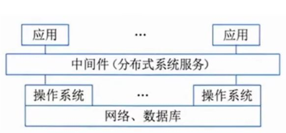
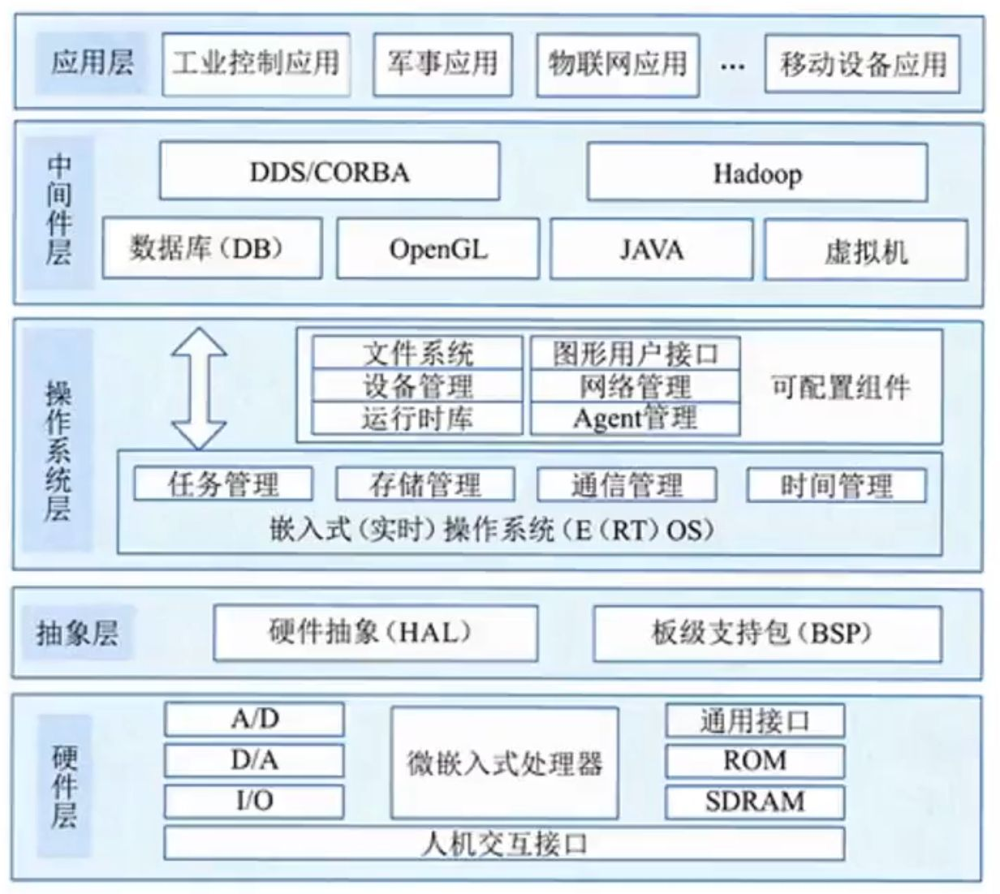

### 中间件

**中间件处**在**操作系统、网络和数据库之上**， **网络、数据库应用软件的下层。☆**
按照中间件在分布式系统中承担的职责不同，可以划分以下几类中间件产品。
1. **通信处理(消息)中间件**:建网和制定出通信协议，以保证系统能在**不同平台之间通信**，实现分布式系统中可靠的、高效的、实时的跨平台数据传输，
2. **事务处理(交易)中间件**:大量事务在多台应用服务器上能实时并发运行，并**进行负载平衡**的调度，实现与昂贵的可靠性机和大型计算机系统的同等功能。
3. **数据存取管理中间件**:为在网络上**虚拟缓冲存取、格式转换、解压**等带来方便。
4. **Web服务器中间件**
5. **安全中间件**
6. **跨平台和架构的中间件**
7. **专用平台中间件**
8. **网络中间件**:它包括网管、接入、网络测试、虚拟社区和虚拟缓冲等

### 软件构件 ☆☆

构件又称为组件，是一个**自包容、可复用的程序集**。构件是一个程序集，或者说是一组程序的集合。这个集合可能会以各种方式体现出来，如源程序或二进制的代码。这个集合整体向外提供统一的访问接口，构件外部只能通过接口来访问构件，而不能直接操作构件的内部。构件的两个最重要的特性是自包容与可重用。构件是**独立的、自包容的**，因此架构的开发也是独立的，构件之间通过接口相互协作。

**构件组装模型**的**优点**如下:构件的**自包容性让系统的扩展变得更加容易**;设计良好的构件更容易被重用，降低软件开发成本;构件的粒度较整个系统更小，因此安排开发任务更加灵活，可以将开发团队分成若干组，并行地独立开发构件。  
构件组装模型也有**明显的缺点**:对构件的设计**需要经验丰富的架构设计师**，设计不良的构件难以实现构件的优点，降低构件组装模型的重用度;**在考虑**软件的**重用度时**，**往往会对其他方面做出让步，如性能等**;使用构件组装应用程序时，要求程序员能熟练地掌握构件，增加了研发人员的学习成本;第三方构件库的质量会最终影响到软件的质量，而第三方构件库的质量往往是开发团队难以控制的。

主流的商用**构件标准规范**包括对象管理组织(0bject Management Group ,0MG)的CORBA、Sun 的J2EE 和Microsoft 的DNA.

1. **公共对象请求代理架构**(Common 0bjeet Request Broker Architecture ，**CORBA**)主要分为**3 个层次**:**对象诸求代理、公共对象服务和公共设施**。**最底层的对象请求代理**(0bject Request Broker,ORB)规定了分布对象的定义(接口)和语言映射，实现对象间的通信和互操作，**是分布对象系统中的“软总线”**;在ORB 之上定义了很多公共服务，可以提供诸如并发服务、名字服务、事务(交易)服务、安全服务等各种各样的服务;**最上层的公共设施**则定义了构件框架，提供**可直接为业务对象使用的服务，规定业务对象有效协作所需的**协定规则。  
   **CORBA CCM ☆** (CORBA Component Model)**构件模型是0MG 组织**制定的一个用于开发和配置**分布式应用的服务器端构件模型规范**，它主要包括如下3 项内容。
	1. **抽象构件模型**:用以描述服务器端构件结构及构件间互操作的结构。
	2. **构件容器结构**:用以提供通用的构件运行和管理环境，并支持对安全、事务、持久状态等系统服务的集成。
	3. **构件的配置和打包规范**:CCM 使用打包技术来管理构件的二进制、多语言版本的可执行代码和配置信息，并制定了构件包的具体内容和文档内容标准。
2. **J2EE**
	   EIB 的 Bean 可 以分为V **会话 Bean 和实体Bean**，前者维护会话，后者处理事务，通常由Servlet 负贵与客户端通信，访问EJB ，并把结果通过JSP 产生页面传回客户端。

### 嵌入式系统及软件

#### 嵌入式系统的组成及特点

**嵌入式系统**(Embedded System)是**为了特定应用**而专门构建且将**信息处理过程**和**物理过程紧密结合为一体的专用计算机系统**。它对功能、可靠性、成本、体积、功耗、环境等综合性能要求严格。嵌入式软件是指可运行在嵌入式系统中的程序代码和帮助这些软件开发所用的工具或环境软件的总称。

1. **嵌入式系统的组成 ☆**
	1. 嵌入式**处理器**;
	2. 相关**支撑硬件**;
	3. **嵌入式操作系统**;
	4. **支撑软件**;
	5. **应用软件**
	
2. **嵌入式系统的特点 ☆☆**
	1. **专用性强**。面向**特定**应用**需求**；
	2. **技术融合**;
	3. **软硬一体**软件为主；
	4. **比通用计算机资源少**。由于嵌入式系统通常只完成少数几个任务。设计时考虑到其经济性，不能使用通用CPU，这就意味着管理的资源少，成本低，结构更简单:
	5. **程序代码固化在非易失存储器中**。为了提高执行速度和系统可靠性，嵌入式系统中的 软件一般都固化在存储器芯片或单片机本身中，而不是存在磁盘中;
	6. **需专门开发工具和环境**。嵌入式系统本身不具备开发能力，即使设计完成以后，用户通常也不能对其中的程序功能进行修改，必须有一套开发工具和环境才能进行开发;
	7. 体积小、价格低、工艺先进、性能价格比高、系统配置要求低、实时性强;
	8. **对安全性和可靠性的要求高**。

### 嵌入式系统及软件

#### 嵌入式系统的分类 ☆

根据**不同用途**可将嵌入式系统划分为:

- **嵌入式实时系统**
	- **强实时** (Hard Real-Time)系统
	- **弱实时** (WeakReal-Time)系统
- 嵌入式**非实时**系统

从**安全性**要求，嵌入式系统可分为:

- **安全攸关系统**(Safety-Critical或 Life.Critical)
- **非安全攸关系统**

##### 1. 实时系统(Real-Time System , RTS )。

实时系统是指能够在指定或者确定的时间内完成系统功能和外部或内部、同步或异步时间做出响应的系统。也就是说，系统计算的正确性不仅取决于程序的逻辑正确性，也取决于结果产生的时间，如果系统的时间约束条件得不到满足，将会发生系统错误。

##### 2. 安全枚关系统(Safety-Critical System)。

安全枚关系统也称为安全关键系统或者安全。生命关键系统(Life -Critical System)，是指其不正确的功能或者失效会导致人员伤亡、财产损失等严重后果的计算机系统。

### 嵌入式系统及软件

#### 嵌入式软件的组成及特点 ☆

嵌入式系统软件组成架构采用层次化结构，并且具备可配置、可剪裁能力。从现代嵌入式系统观看，把嵌入式系统分为硬件层、抽象层、操作系统层、中间件层和应用层。

1. **硬件层**。硬件层主要是为嵌入式系统提供运行支撑的**硬件环境**，其核心是微处理器、存储器(ROM、 SDRAM 、 Flash 等)I/o 接口(A /DD/A 、 I/0 等)和**通用设备以及总线、电源、时钟等**。
2. **抽象层**。在硬件层和软件层之间为抽象层，主要实现对硬件层的硬件进行抽象 ( HAL)，为上层应用(操作系统)提供**虚拟的硬件资源**;**板级支持包(BSP)** 是一种硬件驱动软件，它是**面向硬件层的硬件芯片或电路进行驱动**，**为上层操作系统提供对硬件进行管理的支持**。
3. **操作系统层**。操作系统层主要由嵌入式操作系统、文件系统、图形用户接口、网络系统和通用组件等可配置模块组成。
4. **中间件层**
5. **应用层**

### 嵌入式系统及软件

#### **嵌入式软件**的**主要特点**如下：☆☆☆

1. **可剪裁性**。嵌入式软件能够根据系统功能需求，通过工具进行适应性功能的加或减，删除掉系统不需要的软件模块，使得系统更加紧凑。
2. **可配置性**。嵌入式软件需要具备根据系统运行功能或性能需要而被配置的能力，使得嵌入式软件能够根据系统的不同状态、不同容量和不同流程，对软件工作状况进行能力的扩展、变更和增量服务。
3. **强实时性**。嵌入式系统中的大多数都属于强实时性系统，要求任务**必须在规定的时限(Deadline)内处理完成**，因此，嵌入式软件采用的算法优劣是影响实时性的主要原因。
4. 安全性(Safety)。安全性是指系统**在规定的条件下和规定的时间内不发生事故的能力**。
5. **可靠性**。可靠性是指系统**在规定的条件下和规定的时间周期内程序执行所要求的功能的能力**。
6. **高确定性**。预先设计规划好的，其行为不能随时间、状态的变迁而变化。

